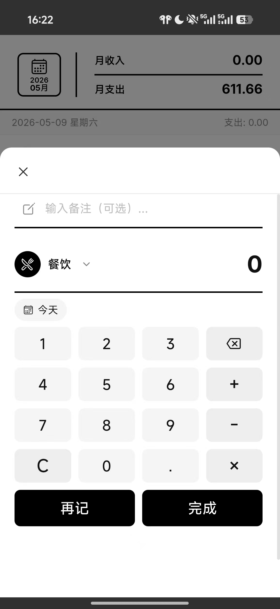
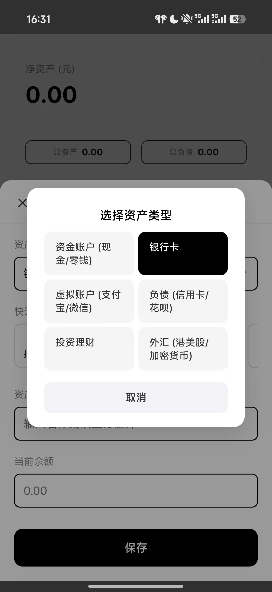
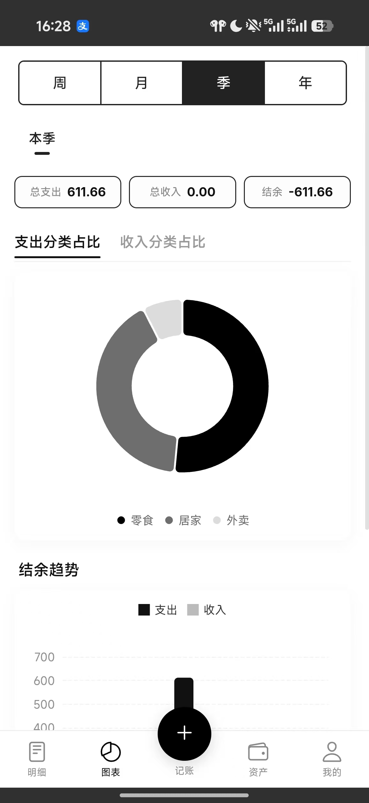
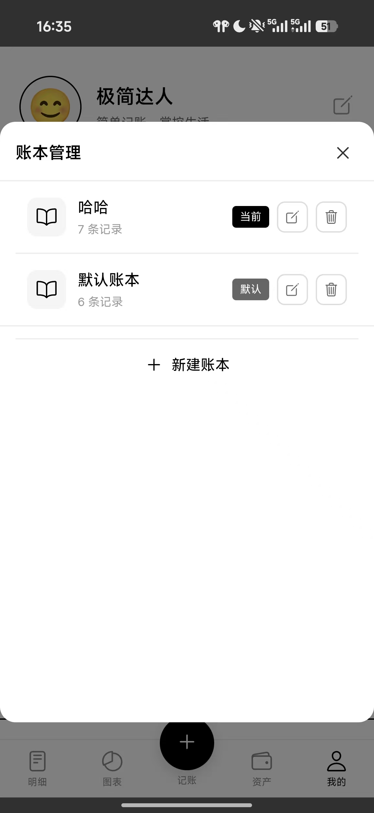
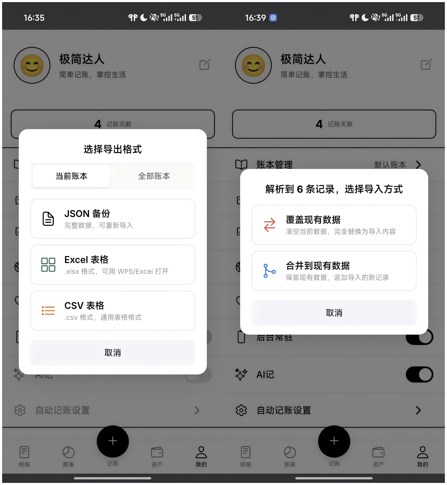

# 贝才 - 极简记账 App 🪙

<p align="center">
  
</p>

<p align="center">
  <strong>一款“开箱即用、本地存储、隐私无忧”的极简主义个人记账工具。</strong>
</p>

<p align="center">
  
  
  
  
</p>

---

## 💡 极简设计理念

> “市面上的记账软件要么太复杂，要么广告多，要么强制绑定账号并上传隐私。我就想要一个简单、干净、绝对安全的记账工具，于是有了**贝才**。”

> [!IMPORTANT]
> **🔒 隐私核心保障**
> 贝才采用**纯前端 / 本地原生**实现。所有财务数据、账本记录均存储在您本机的浏览器安全沙盒或本地数据库中，**绝不上传服务器**，从根源上杜绝了个人隐私泄露的风险。

---

## ✨ 核心亮点

* 🖤 **极简黑白美学**：精心设计的黑白极简 UI，减少视觉干扰，让记账回归财务记录本质。
* 🔋 **零注册，开箱即用**：不需要绑定手机，不需要注册账号，直接打开即用。
* 📦 **双平台运行**：完美支持现代现代浏览器（Web 端）与 Android 手机端（通过 Capacitor 构建）。
* 🚀 **强悍离线 AI 记账**：Android 端支持通过无障碍服务及本地 OCR 智能解析支付通知，实现**完全单机、秒级自动记账**。
* 💾 **万能备份与双模导入**：支持 JSON 完整备份，并提供合并/覆盖两种导入模式，让数据迁移随心所欲。

---

## 📖 核心功能详解与操作指南

### 1. 极速记账与分类管理 ✍️
提供最为流畅的记账体验，配合高效的自定义机制。
* **自定义分类**：内置 24 种支出分类与 10 种收入分类，支持用户一键新增自定义分类，随心挑选图标。
* **快速计算键盘**：内置四则运算键盘，在输入金额的同时快速计算账目，无需切换其他计算器。
* **手把手记账步骤**：
  1. 点击主界面底部的正中央浮动 **`+`** 按钮。
  2. 选择 **“支出”** 或 **“收入”** 类型。
  3. 输入金额（可直接在专用键盘上进行 `+ - * /` 运算）。
  4. 挑选直观的分类图标（如餐饮、交通、购物等）。
  5. 录入备注（可选）与选择交易日期。
  6. 点击 **“完成”** 保存；或点击 **“再记”** 快速录入下一笔。

<div align="center">
  
  <p><em>图：极速记账弹窗与内置计算键盘</em></p>
</div>


---

### 2. 资产管理与余额调整 🏦
全方位掌握您的身家资产，支持复杂的账户架构与本币/外币折算。
* **六大资产账户**：

| 账户大类 | 包含子项 preset | 适用场景 |
| :--- | :--- | :--- |
| **资金账户** | 现金、零钱 | 钱包现钞、微信/支付宝零钱等 |
| **银行卡** | 招商银行、工商银行、建设银行等 | 各类储蓄卡、借记卡 |
| **虚拟账户** | 支付宝、微信支付 | 第三方线上电子支付钱包 |
| **负债账户** | 信用卡、花呗 | 各种消费信贷与负债管理 |
| **投资理财** | 基金、股票、定期理财 | 专款专用的理财资金账户 |
| **外币资产** | 美元(USD)、港币(HKD)资产 | 支持配置汇率，自动折算为本币净资产 |

* **手把手资产管理步骤**：
  1. 切换至 **“资产”** 标签页。
  2. 点击 **“+ 添加资产”**，选择资产类别并输入初始余额。
  3. 点击任意资产卡片可进入**“资产详情”**，查看名下专属收支明细。
  4. 支持一键 **“调整余额”**：手动校准账户最新金额，系统会自动创建一笔“余额调整”记录，保持账目完全平齐。

<div align="center">
  
  <p><em>图：资产概览与余额动态调整</em></p>
</div>


---

### 3. 多维度图表与统计分析 📊
数据可视化由百度 ECharts 强力驱动，轻松洞察收支结构与财富走势。
* **多时间维度**：支持 **周、月、季、年** 四种宏观/微观的统计算法。
* **收支分类饼图**：直观展示各类消费所占比例，点击饼图扇区即可下钻查看精确金额。
* **结余趋势折线图**：动态呈现每一天的资金变动曲线，支持移动端手势的自由缩放与左右拖拽。
* **分类排行榜**：自动按金额对您的各类别开销进行降序/升序排行，配有美观的横向进度条，揪出您的“吞金兽”。

<div align="center">
  
  <p><em>图：多维度收支饼图与资金结余趋势</em></p>
</div>


---

### 4. 多账本管理与数据迁移 📁
支持生活、工作、家庭等多个场景下的账本划分，保障不同账目的纯粹性。
* **多账本隔离**：如“个人账本”、“家庭账本”、“旅行账本”等，各个账本数据完美物理隔离，可在“我的”页面一键秒级切换。
* **智能数据迁移**：当您删除某一个不再需要的账本时，系统会贴心地询问您是否将该账本的交易记录全部迁移到另一个现存账本中，防止记录丢失。

<div align="center">
  
  <p><em>图：账本轻松新建、无缝切换与迁移删除</em></p>
</div>


---

### 5. 万能数据导入导出与备份 💾
确保数据的所有权完全掌握在您手中，支持与其他记账工具的无缝联动。

* **丰富的导出格式**：
  * **JSON 完整备份**：备份包含交易、资产、配置、汇率在内的**所有完整数据**，可用于后续完美一键重构恢复。
  * **Excel 表格 (.xlsx)**：完美导出至 Excel 电子表格，方便用 Office / WPS 或进行高级透视表分析。
  * **CSV 通用表格**：最佳的通用兼容性，方便数据库或其他分析软件导入。
* **智能双模导入**：

```
导入数据时，系统支持两种人性化策略选择：
├── 🔄 覆盖现有数据：完全清空本地 IndexedDB 数据库，用导入的文件取而代之。
└── 🔗 合并到现有数据：保留本机的历史数据，将新记录追加进来（自动执行智能排重，去重无忧）。
```

<div align="center">
  
  <p><em>图：多格式数据一键导出与智能合并导入</em></p>
</div>


---

### 6. 强悍的 Android AI 自动记账 🤖 *(高级版特性)*
Android 专属的智能前沿黑科技，基于纯单机无障碍服务与 OCR 引擎实现，为您节省每一秒。
* **实时通知栏监控**：后台服务自动监控微信、支付宝等支付通知推送。
* **完全离线 OCR 提取**：触发支付时，系统前台通过 Google ML Kit 中文 OCR 引擎智能提取截屏内容。
* ** rule-engine 智能提取**：内置规则分析引擎（正则表达式 + 核心关键词检索），在手机本地完成交易商户、金额、发生日期的精确匹配，**全程无需联网，彻底杜绝隐私外泄**。

<div align="center">
  
  <p><em>图：AI 自动记账设置与后台常驻快捷入口</em></p>
</div>


---

## 🛠️ 技术栈选型

贝才应用经过精简架构设计，采用了最现代、最轻量的技术方案，确保软件秒开、运行流畅：

* **核心框架**：HTML5 + Vanilla CSS3 + 原生 JavaScript (ES6+ 模块化，完全无打包构建工序，轻装上阵)
* **数据可视化**：Baidu ECharts 5.5.0 (卓越的移动端折线图、饼图动画支持)
* **图表/字体系统**：Ionicons 7.1.0 (清爽黑白图标) + Outfit / Inter 现代字族
* **表格处理**：SheetJS (xlsx) 0.18.5 (纯前端快速解析/生成 Excel 数据流)
* **跨平台桥接**：Capacitor 8.3.1 (极佳的 Web-to-Native 桥接，运行速度远超 Cordova)
* **Android 原生技术**：Java (用于无障碍辅助服务、后台常驻服务、Google ML Kit 16.0.1 离线 OCR 识别)

---

## 🚀 使用与部署方式

### 🌐 Web 版本 (直接使用)
无需任何编译工具，开箱即用：
1. 使用现代浏览器（Chrome、Edge、Firefox 等）直接打开项目下的 `www/index.html`。
2. 建议通过浏览器的 **“添加到桌面/安装为 PWA”** 功能，将其作为独立 App 固定在任务栏使用，体验极佳。

### 🤖 Android 原生编译步骤
1. 确保本地拥有 `Node.js` 运行环境、Java JDK 以及安装了 `Android Studio`。
2. 在项目根目录下执行依赖安装：
   ```bash
   npm install
   ```
3. 将前端核心代码同步推送到本地的 Android 项目中：
   ```bash
   npx cap sync android
   ```
4. 调用本地 IDE 打开 Android 工程：
   ```bash
   npx cap open android
   ```
5. 在 Android Studio 中点击运行或打包，即可编译出 `.apk` 安装文件。

---

## ❓ 常见问题 (FAQ)

#### Q1: 我的财务数据会丢失吗？
> [!WARNING]
> **⚠️ 必须注意的浏览器缓存机制**
> 本应用的数据安全地保存在您本机的浏览器数据库（IndexedDB / localStorage）中。
> 1. 通常情况下，刷新浏览器、关机重启数据均不会丢失。
> 2. 但如果您**主动清空了浏览器缓存数据、使用了浏览器的“深度清理隐私”功能、或者使用了无痕模式**，数据可能会被浏览器内核擦除。
> 3. **💡 强烈建议**：定期使用“我的” -> “导出数据” -> **“JSON 备份”** 导出文件到云盘或本地物理盘，确保万无一失！

#### Q2: 既然不使用服务器，怎么做到多设备同步？
> **答**：为了保障绝对的隐私，贝才不支持自动的云端数据库同步。但您可以通过**“导出 JSON 备份”**，通过微信、QQ 或网盘将该 `.json` 备份文件传输到您的其他设备，然后在另外一台设备上选择**“导入数据” -> “合并/覆盖导入”**来完成数据的手动迁移与同步。

#### Q3: AI 自动记账支持哪些应用？
> **答**：在 Android 手机端开启无障碍服务与常驻后台通知栏后，目前主要支持微信支付（微信转账、零钱扣款、微信扫码等）、支付宝扫码与支付扣款的即时通知捕获，其核心规则匹配在后台智能处理。

---

## 🤝 许可证与联系作者

* 本项目遵循 [Apache License 2.0](https://www.apache.org/licenses/LICENSE-2.0) 许可协议。
* **GitHub**: [@Justin-Mai](https://github.com/Justin-Mai/BeiCai)
* **邮箱**: 813370079@qq.com

---

## 💖 打赏支持

如果您觉得“贝才”对您的个人理财规划有帮助，欢迎用一杯咖啡或一瓶可乐打赏支持作者的无私开源创作！

<div align="center">
  
</div>
